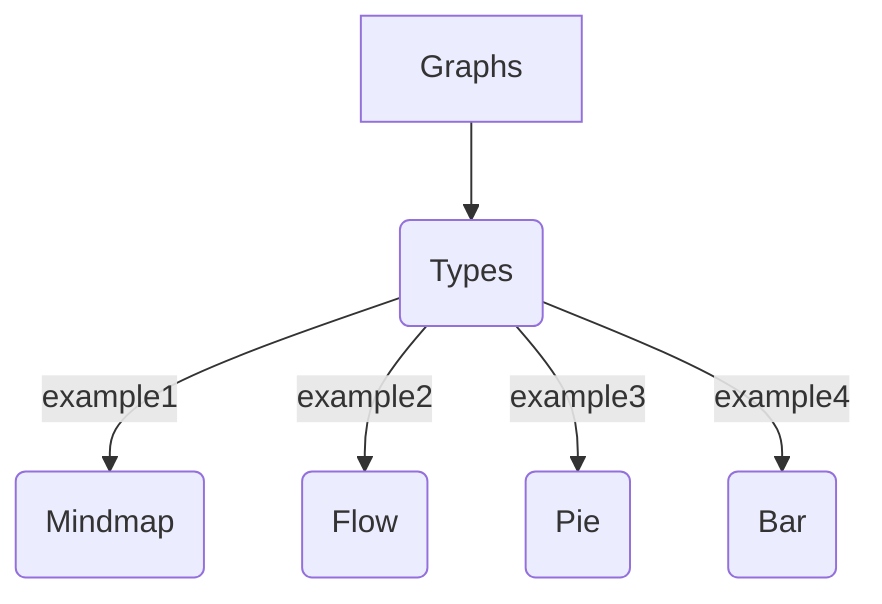
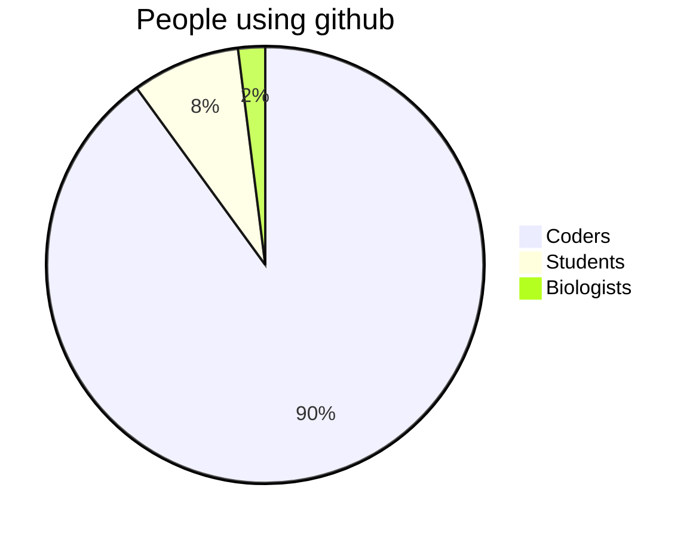

# Publish-a-graph

This is an example of using Mermaid to build a graph in github.

Flow chart:

```mermaid
flowchart TD
    A[Graphs] --> B(Types)
    B --> |example1| C(Mindmap)
    B --> |example2| D(Flow)  
    B --> |example3| E(Pie)
    B --> |example4| F(Bar)
```

Pie chart:

```mermaid
pie title People using github
    "Coders" : 900
    "Students" : 80
    "Biologists" : 20
```
